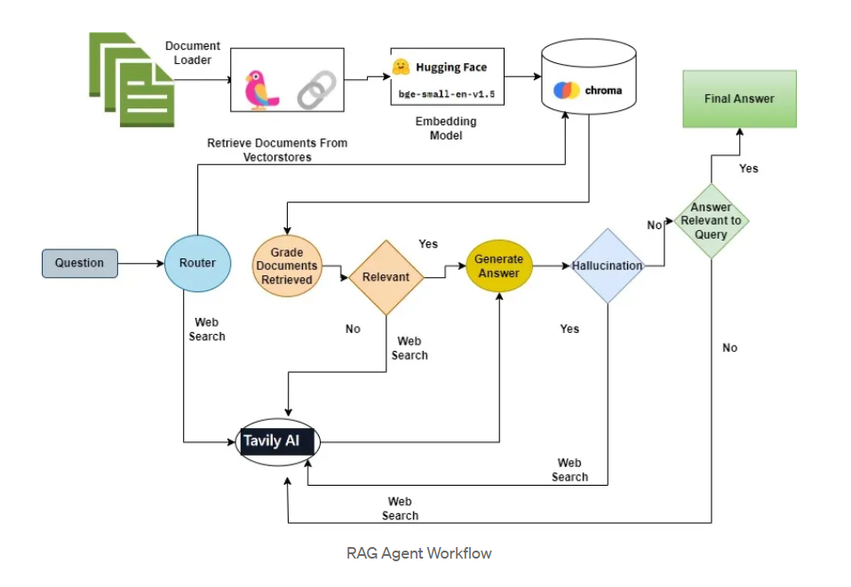

# RAG Trinity

  

## Description
A smart RAG agent that finds accurate answers by searching documents and the web. It checks itself at every step to make sure the information is relevant and the answers are truthful, not made up. Uses three quality control methods (Adaptive, Corrective, and Self-RAG) to give you reliable responses you can trust